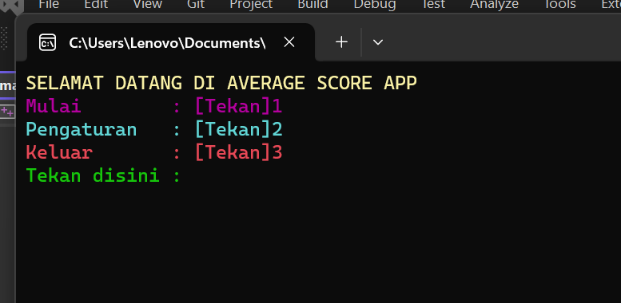
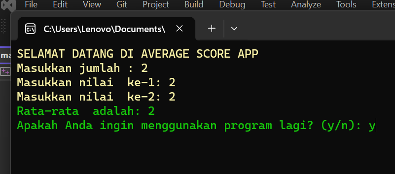

  <h1>🚀 Average Score App 🚀</h1>
  
<b>Program akhir semester 1 dari Kelompok 10</b>

---

## Deskripsi Aplikasi

"Average Score App" adalah sebuah aplikasi konsol sederhana yang memungkinkan pengguna untuk menghitung rata-rata dari sejumlah nilai numerik.

### Fitur Utama

- **Menu Utama**: Pilih dari berbagai opsi menu termasuk perhitungan rata-rata, pengaturan nama ruang, atau keluar dari program.
- **Perhitungan Rata-Rata**: Input nilai numerik dan aplikasi akan menghitung rata-rata.
- **Pengaturan Nama Ruang**: Atur nama ruang untuk mengidentifikasi jenis data.
- **Pengulangan Program**: Pilihan untuk menjalankan program lagi atau keluar setelah perhitungan selesai.

  
  
<i>Tampilan Menu</i>

  
  
<i>Tampilan Program</i>

## Instalasi

1. Pastikan Anda memiliki [compiler C++](https://gcc.gnu.org/install/index.html) terinstal.
2. Clone repositori ini.
3. Buka terminal atau command prompt.
4. Pindah ke direktori repositori.
5. Kompilasi program: `g++ main.cpp -o AverageScoreApp.cpp`.
6. Jalankan program: `./AverageScoreApp.cpp`.

### Kontribusi Anggota Tim

#### Anggota 1: [Lamberth Paulinus Rumpaidus](https://github.com/lamberthpaulinusrumpaidus) 23.11.5826
- Ketua
- Kontribusi: Sebagai ketua tim, memiliki peran dalam mengkoordinasikan seluruh proyek, memastikan kelancaran alur kerja, dan membantu dalam pengambilan keputusan strategis. juga berkontribusi dalam merancang dan mengembangkan aplikasi serta memastikan pemenuhan tujuan proyek.

#### Anggota 2: [Hasandro Tumanggor](https://github.com/Hasandrotumanggor) 23.11.5816
- Anggota
- Kontribusi: salah satu kontributor utama dalam pengembangan aplikasi "Average Score App." yang berfokus pada implementasi dan pengujian berbagai fitur aplikasi, memastikan bahwa program berjalan sesuai dengan spesifikasi proyek.

#### Anggota 3: [Awaludin](https://github.com/Awlldnn) 23.11.5822
- Anggota
- Kontribusi: juga berperan dalam mengembangkan aplikasi ini dengan fokus pada perbaikan dan perbaikan kode, serta membantu dalam pengujian dan pemecahan masalah. Mmemiliki peran penting dalam memastikan kualitas dan keandalan aplikasi.

#### Anggota 4: [Anthomy Pehan Goran](https://github.com/AnthomyPehan) 23.11.5865
- Anggota
- Kontribusi: berperan dalam pengembangan aplikasi ini dengan fokus pada desain antarmuka pengguna (UI) dan pengalaman pengguna. Bertanggung jawab atas tampilan visual aplikasi dan interaksi pengguna yang baik.
